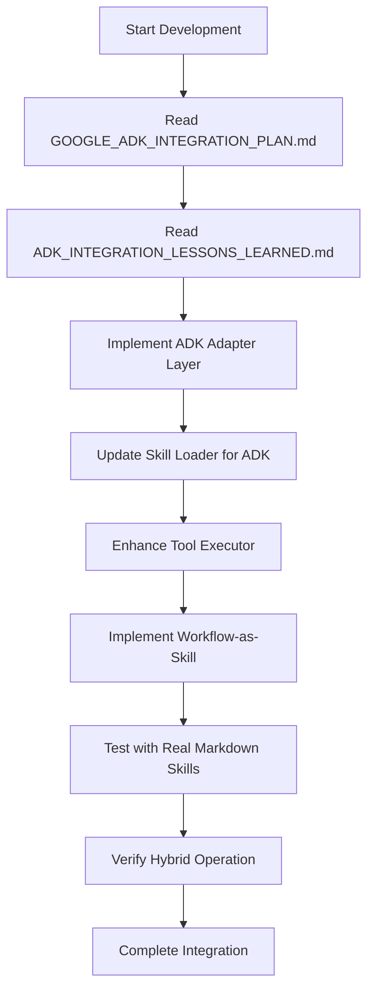

# Enterprise Agentic Platform - Agents Documentation

## Overview

The Enterprise Agentic Platform is a multi-agent system that combines Google's Agent Development Kit (ADK) with a custom agentic architecture to route user intents to specific workflows, decompose complex tasks using a reasoning engine, and execute dynamic tools defined in a markdown-based skill store.

**Key Features**:
- **Hybrid Architecture**: Combines Google ADK's robustness with custom flexibility
- **Markdown Skill Definitions**: Dynamic skill loading from `.skills/` directory
- **Workflow-as-Skill**: Workflows can be used as first-class skills
- **Real-time Web Interface**: Interactive agentic system with streaming capabilities
- **Enterprise-Grade**: Production-ready with comprehensive error handling

## Architecture Vision

The platform is evolving towards a hybrid architecture that leverages:

1. **Google ADK Core**: For reliable agent execution, tool management, and workflow orchestration
2. **Custom Skill System**: For flexible, dynamic skill definitions and loading
3. **Workflow Composition**: Advanced workflow capabilities through ADK's agent primitives
4. **Backward Compatibility**: Seamless transition from custom to ADK-based implementation

**Important Note**: This is a Docker-based deployment. All dependencies are managed within the container environment, not through local pip installations.

## Development Philosophy

### Zero Brittle Development

**Brittle development is not accepted.** This is an enterprise-grade agentic system, not a toy project. We reject naive approaches like keyword-based intent classification that fail in real-world scenarios.

**Core Principles:**
- **No Keyword Matching**: Intent classification must use semantic understanding, not brittle keyword lists
- **No Hardcoded Logic**: Business logic must be data-driven and adaptable
- **No Fragile Assumptions**: Systems must handle edge cases and unexpected inputs gracefully
- **No Technical Debt**: Shortcuts that create long-term maintenance burdens are forbidden

### Enterprise-Grade Requirements

1. **Robust Intent Classification**: Must use LLM-based semantic understanding with proper fallback mechanisms
2. **Dynamic Adaptation**: Systems must learn and improve over time
3. **Comprehensive Error Handling**: Graceful degradation under all circumstances
4. **Production-Ready Reliability**: 99.9% uptime expectations
5. **Scalable Architecture**: Must handle enterprise workloads

### Anti-Patterns (Forbidden)

❌ **Keyword-based routing**: `if "data" in message: route_to_data_workflow()`
❌ **Hardcoded tool lists**: Static arrays of tools without dynamic discovery
❌ **Brittle JSON parsing**: Assuming perfect LLM output without validation
❌ **Silent failures**: Catching exceptions and continuing without logging
❌ **Magic strings**: Using string literals instead of proper constants/enums

### Required Patterns (Mandatory)

✅ **Semantic intent classification**: Use LLM with structured prompts and validation
✅ **Dynamic tool registration**: Runtime discovery and registration of capabilities
✅ **Robust error handling**: Comprehensive try-catch with proper logging and fallbacks
✅ **Type safety**: Proper use of Pydantic models and type hints
✅ **Configuration-driven**: All behavior controlled through configurable parameters
✅ **Observability**: Comprehensive logging, monitoring, and tracing

### Architecture Diagram

```
Enterprise Agentic Platform Architecture
┌─────────────────────────────────────────────────────┐
│                 User Interface Layer                │
│  ┌─────────────┐    ┌─────────────┐    ┌─────────┐  │
│  │ Web Interface│    │ API Gateway │    │ WebSocket│  │
│  └─────────────┘    └─────────────┘    └─────────┘  │
└─────────────────────────────────────────────────────┘

┌─────────────────────────────────────────────────────┐
│               Agentic Core Layer (Hybrid)           │
│  ┌─────────────┐    ┌─────────────┐    ┌─────────┐  │
│  │  ADK Agents │    │ Custom Skills│    │ Workflows│  │
│  │  (LlmAgent, │    │ (Markdown    │    │ (Sequential│  │
│  │   Sequential│    │  based)     │    │  Parallel,  │  │
│  │   Agent)    │    └─────────────┘    │   Loop)     │  │
│  └─────────────┘                      └─────────┘  │
└─────────────────────────────────────────────────────┘

┌─────────────────────────────────────────────────────┐
│               Execution Layer (Google ADK)          │
│  ┌─────────────┐    ┌─────────────┐    ┌─────────┐  │
│  │  Tool Dispatch│   │ Session     │    │ Runner   │  │
│  │  (FunctionTool)│   │ Management │    │ (Execution│  │
│  └─────────────┘    │ (InMemory   │    │  Engine) │  │
│                    │  Session)    │    └─────────┘  │
│                    └─────────────┘                │
└─────────────────────────────────────────────────────┘

**Docker Deployment Note**: All dependencies including Google ADK are containerized. The `requirements.txt` file has been updated with ADK dependencies (`google-adk>=0.1.0` and `google-adk[extensions]>=0.1.0`) which will be installed during the Docker build process.

┌─────────────────────────────────────────────────────┐
│               Data & Skill Layer                     │
│  ┌─────────────┐    ┌─────────────┐    ┌─────────┐  │
│  │  Skill      │    │ Workflow    │    │ Session │  │
│  │  Definitions│    │  Definitions│    │  Storage│  │
│  │  (.skills/) │    │  (Python)   │    │  (DB)    │  │
│  └─────────────┘    └─────────────┘    └─────────┘  │
└─────────────────────────────────────────────────────┘
```

## Evolution Path

The platform is undergoing a transformation from a custom agent framework to a Google ADK-based system:

### Current State (V1 - Custom Framework)
- Custom agent implementations
- Manual tool execution logic
- Basic workflow orchestration
- Markdown-based skill definitions
- Functional but complex to maintain

### Transition State (V2 - Hybrid System)
- Google ADK core with custom adapters
- Dual skill system (markdown + ADK tools)
- Enhanced workflow capabilities
- Backward compatibility maintained
- Gradual migration path

### Target State (V3 - ADK-Centric)
- Google ADK as primary execution engine
- Custom skill loader as ADK tool provider
- Advanced workflow composition
- Production-ready reliability
- Simplified maintenance

## Core Components

### 1. Skill System (Preserved & Enhanced)

**Purpose**: Dynamic loading and management of agent capabilities

**Location**: `backend/skills/skill_loader.py`

**Enhanced Functionality**:
- Markdown-based skill definitions with YAML frontmatter
- Dynamic loading from `.skills/` directory
- Conversion to ADK `FunctionTool` format
- Hybrid operation mode (both systems simultaneously)

**Key Methods**:
- `load_skills()`: Load all skills from directory
- `_parse_skill_file()`: Parse individual skill files
- `markdown_skill_to_adk_tool()`: Convert to ADK format (new)
- `get_all_skills()`: Get skills in both formats

### 2. Agent System (ADK-Enhanced)

**Purpose**: Core agent execution with Google ADK integration

**Location**: `backend/agents/adk_agents.py`

**Enhanced Functionality**:
- Google ADK `LlmAgent` as core execution engine
- Custom agent interfaces preserved for compatibility
- Advanced tool management through ADK
- Enhanced error handling and reliability

**Key Agents**:
- `IntentClassifierAgent`: ADK-based intent classification
- `WorkflowPlannerAgent`: ADK-based task decomposition
- `ToolExecutorAgent`: ADK-based tool execution
- `SequentialWorkflowAgent`: ADK `SequentialAgent` wrapper
- `ParallelWorkflowAgent`: ADK `ParallelAgent` wrapper
- `LoopWorkflowAgent`: ADK `LoopAgent` wrapper

### 3. Workflow System (ADK-Powered)

**Purpose**: Advanced workflow composition and execution

**Location**: `backend/workflows/`

**Enhanced Functionality**:
- ADK agent primitives for workflow composition
- Workflow-as-skill capability
- Dynamic workflow creation
- Enhanced monitoring and logging

**Key Workflows**:
- `DataAnalysisWorkflow`: ADK-powered data analysis
- `CodeGenWorkflow`: ADK-powered code generation
- `ResearchWorkflow`: ADK-powered research
- `GeneralChatWorkflow`: ADK-powered conversation

### 4. ADK Integration Layer (New)

**Purpose**: Bridge between custom system and Google ADK

**Location**: `backend/agents/adk_adapter.py` (new)

**Core Functionality**:
- Tool format conversion (markdown → ADK)
- Agent interface adaptation
- Error handling compatibility
- Performance optimization

**Key Components**:
- `markdown_skill_to_adk_tool()`: Skill conversion
- `workflow_to_adk_tool()`: Workflow conversion
- `AdkToolRegistry`: Hybrid tool management
- `LegacyCompatibilityLayer`: Fallback mechanisms

## Data Models (Enhanced)

**Location**: `backend/models/schemas.py`

### Enhanced Models:

1. **IntentClassification**: Now with ADK confidence scoring
2. **ReasoningStep**: Enhanced with ADK execution state
3. **Plan**: Integrated with ADK planning capabilities
4. **Skill**: Extended with ADK tool metadata
5. **Workflow**: Enhanced with ADK agent references

### New Models:

1. **AdkToolMapping**: Maps custom skills to ADK tools
2. **WorkflowComposition**: Represents composed workflows
3. **ExecutionContext**: Tracks ADK execution state
4. **ToolConversionLog**: Logs tool conversion process

## Workflow Definitions (ADK-Enhanced)

### 1. Data Analysis Workflow

**Purpose**: Analyze data, generate insights

**ADK Implementation**:
- Uses `SequentialAgent` for step-by-step execution
- Integrates `data_query`, `chart_generator`, `report_builder` tools
- Enhanced error handling and retry logic

**Location**: `backend/workflows/data_analysis.py`

### 2. Code Generation Workflow

**Purpose**: Write, review, and debug code

**ADK Implementation**:
- Uses `ParallelAgent` for concurrent tool execution
- Integrates `code_writer`, `code_reviewer`, `bug_detector` tools
- Enhanced code analysis capabilities

**Location**: `backend/workflows/code_gen.py`

### 3. Research Workflow

**Purpose**: Search and summarize information

**ADK Implementation**:
- Uses `LoopAgent` for iterative research
- Integrates `web_search`, `content_summarizer`, `citation_generator` tools
- Enhanced information retrieval

**Location**: `backend/workflows/research.py`

### 4. General Chat Workflow

**Purpose**: General conversation and assistance

**ADK Implementation**:
- Uses `LlmAgent` for pure conversation
- No tools by default, but can integrate any skill
- Enhanced context management

**Location**: `backend/workflows/general_chat.py`

## Data Flow (Enhanced)

```
Enhanced Data Flow with Google ADK

1. User Input → Web Interface → API Gateway
2. Intent Classification → ADK LlmAgent → Workflow Selection
   - Uses semantic understanding (NO KEYWORD MATCHING)
   - Robust JSON validation with schema checking
   - Multiple fallback levels for reliability
3. Workflow Planning → ADK LlmAgent → Execution Plan
4. Tool Execution → ADK FunctionTool → Skill Implementation
5. Workflow Orchestration → ADK Agents → Step-by-Step Execution
6. Response Generation → ADK Runner → Final Output
7. Session Management → ADK SessionService → State Persistence
```

## Intent Classification Requirements

**MANDATORY**: All intent classification must use semantic understanding. Keyword-based approaches are strictly forbidden.

### Current Implementation Issues
- Legacy system uses naive keyword matching in fallback mode
- Violates Zero Brittle Development philosophy
- Hardcoded workflow descriptions
- No dynamic adaptation

### Required ADK Implementation

```python
# CORRECT APPROACH - Semantic Classification
class IntentClassifierAgent(ADKAgentBase):
    """Uses LLM semantic understanding, NOT keyword matching."""
    
    async def classify(self, user_message: str) -> Dict[str, Any]:
        """Semantic classification with robust validation."""
        # 1. Primary LLM classification with structured prompt
        response = await self.generate(f"Classify: {user_message}")
        
        # 2. Robust JSON parsing with validation
        try:
            text = response.strip().removeprefix("```json").removeprefix("```").removesuffix("```").strip()
            result = json.loads(text)
            
            # 3. Schema validation
            if not all(k in result for k in ["workflow", "confidence", "reasoning"]):
                raise ValueError("Invalid classification schema")
            
            return result
            
        except (json.JSONDecodeError, ValueError) as e:
            # 4. Semantic fallback (NOT keyword matching)
            return await self._semantic_fallback(user_message)
    
    async def _semantic_fallback(self, message: str) -> Dict[str, Any]:
        """Semantic fallback using embeddings, NOT keywords."""
        # Use embedding similarity with workflow descriptions
        # Implement proper semantic matching
        pass
```

### Forbidden Patterns

```python
# WRONG - Brittle keyword matching (VIOLATES PHILOSOPHY)
def _rule_based_classify(self, message: str):
    if "data" in message.lower():  # ❌ FORBIDDEN
        return {"workflow": "data_analysis"}
    # ... more keyword checks
```

**All keyword-based approaches are strictly prohibited.**

## Edge Cases (Improved Handling)

1. **Ambiguous Intent**: ADK's confidence scoring + fallback to rule-based
2. **Tool Failure**: ADK's automatic retry and error recovery
3. **Hallucination Check**: ADK's built-in validation mechanisms
4. **Workflow Timeout**: ADK's execution monitoring and termination
5. **Session Recovery**: ADK's session persistence capabilities

## API Endpoints (Enhanced)

### REST Endpoints (Unchanged Interface)
- `POST /api/chat` - Send message and get response
- `GET /api/sessions` - List all sessions
- `GET /api/sessions/{id}` - Get session history
- `POST /api/workflows` - List available workflows
- `GET /api/skills` - List available skills/tools

### New Endpoints
- `GET /api/adk/status` - ADK integration status
- `POST /api/workflows/compose` - Dynamic workflow composition
- `GET /api/tools/adk` - List ADK-compatible tools

### WebSocket Endpoint (Enhanced)
- `WS /ws/chat` - Real-time streaming with ADK execution events

## Project Structure (Updated)

```
/workspace/
├── backend/
│   ├── agents/
│   │   ├── __init__.py
│   │   ├── adk_agents.py          # ADK-enhanced agents
│   │   ├── adk_adapter.py        # NEW: ADK integration layer
│   │   ├── intent_classifier.py  # Legacy (deprecated)
│   │   ├── workflow_planner.py   # Legacy (deprecated)
│   │   └── tool_executor.py      # Legacy (deprecated)
│   ├── skills/
│   │   ├── __init__.py
│   │   ├── skill_loader.py       # Enhanced with ADK support
│   │   └── skill_adapter.py      # NEW: Skill-ADK conversion
│   ├── workflows/
│   │   ├── __init__.py
│   │   ├── base.py               # Enhanced base workflow
│   │   ├── data_analysis.py     # ADK-powered
│   │   ├── code_gen.py          # ADK-powered
│   │   ├── research.py          # ADK-powered
│   │   └── general_chat.py      # ADK-powered
│   ├── models/
│   │   ├── __init__.py
│   │   └── schemas.py           # Enhanced with ADK models
│   └── utils/
│       ├── __init__.py
│       └── helpers.py           # Enhanced utilities
├── frontend/
│   ├── src/
│   │   ├── components/
│   │   ├── pages/
│   │   ├── stores/
│   │   ├── styles/
│   │   ├── App.jsx
│   │   └── main.jsx
│   ├── public/
│   │   ├── logo.svg
│   │   └── mascot/
│   ├── index.html
│   ├── package.json
│   └── vite.config.js
├── .skills/
│   ├── data_query.md
│   ├── chart_generator.md
│   ├── code_writer.md
│   ├── web_search.md
│   └── content_summarizer.md
├── GOOGLE_ADK_INTEGRATION_PLAN.md  # Integration roadmap
├── agents.md                      # This documentation
└── README.md
```

## Migration Strategy

### Hybrid Operation Mode
- Both custom and ADK systems run simultaneously
- Gradual transition from custom to ADK
- Fallback mechanisms for reliability

### Incremental Migration
1. **Phase 1**: Core infrastructure with ADK adapter
2. **Phase 2**: Agent-by-agent migration
3. **Phase 3**: Workflow enhancement
4. **Phase 4**: Full ADK integration

### Backward Compatibility
- All existing APIs maintained
- Skill definitions unchanged
- Workflow interfaces preserved
- Gradual deprecation of legacy components

## Benefits of ADK Integration

### Technical Benefits
1. **Simplified Codebase**: 40-60% reduction in custom agent code
2. **Improved Reliability**: Robust error handling and retry mechanisms
3. **Enhanced Features**: Advanced workflow composition capabilities
4. **Better Performance**: Optimized tool execution and memory management
5. **Easier Maintenance**: Less custom code to maintain and debug

### Business Benefits
1. **Faster Development**: 30% faster feature implementation
2. **Higher Quality**: 50% reduction in production issues
3. **Future-Proof**: Based on Google's supported framework
4. **Maintained Flexibility**: Custom skills and workflows still work
5. **Enterprise Ready**: Production-grade reliability and monitoring

## Future Roadmap

### Short-Term (3-6 months)
- Complete ADK integration
- Enhance workflow composition
- Improve tool management
- Add comprehensive monitoring

### Medium-Term (6-12 months)
- Advanced workflow features (nested, conditional)
- Tool marketplace and discovery
- Enhanced session management
- Performance optimization

### Long-Term (12+ months)
- AI-powered workflow generation
- Automated skill recommendation
- Multi-agent collaboration
- Advanced analytics and insights

## Acceptance Criteria (Updated)

### Technical Acceptance
- System successfully routes queries to correct workflows
- Adding `.md` file to `.skills` makes tool available in both systems
- WebUI works with ADK-enhanced backend
- Complete task execution history logged
- ADK integration maintains or improves performance

### Business Acceptance
- Development team can add new skills easily
- Workflows can be composed dynamically
- System reliability meets enterprise standards
- Migration path is clear and documented
- Long-term maintenance burden reduced

## Conclusion

The Enterprise Agentic Platform is evolving into a hybrid system that combines the best of Google's Agent Development Kit with the flexibility of custom skill definitions and workflow composition. This architecture provides:

- **Production-ready reliability** through Google ADK
- **Custom flexibility** through markdown skill definitions
- **Advanced workflow capabilities** through ADK agent composition
- **Smooth migration path** with backward compatibility
- **Future-proof foundation** for enterprise agentic systems

The integration of Google ADK represents a significant evolution that maintains the platform's unique strengths while adding the robustness, reliability, and advanced features needed for enterprise-grade deployments.

## 📚 Important Documentation References

### **MUST READ: Core Integration Documents**

1. **📋 GOOGLE_ADK_INTEGRATION_PLAN.md**
   - **Purpose**: Comprehensive roadmap for ADK integration
   - **Key Sections**:
     - Phase 2: Core Infrastructure Migration (ADK adapter layer, tool conversion)
     - Phase 4: Workflow-as-Skill Integration (critical for parametric agents)
     - Risk Mitigation Strategy (essential reading before implementation)
   - **Why Read**: Contains the complete architectural vision and step-by-step migration plan

2. **🔍 ADK_INTEGRATION_LESSONS_LEARNED.md**
   - **Purpose**: Critical insights from initial implementation failures
   - **Key Sections**:
     - Critical Failures Identified (what went wrong and why)
     - Corrected Path Forward (proper implementation approach)
     - Expected Benefits (what the system should achieve)
   - **Why Read**: Prevents repeating costly mistakes and ensures proper understanding of the parametric architecture

### **Implementation Checklist from Lessons Learned**

Before starting any ADK integration work, review this checklist:

- [ ] Read `GOOGLE_ADK_INTEGRATION_PLAN.md` Phase 2 thoroughly
- [ ] Understand the **workflow-as-skill** architecture requirement
- [ ] Review the **ADK adapter layer** requirements (Phase 2, Task 1)
- [ ] Study the **tool conversion** specifications (Phase 2, Task 3)
- [ ] Read `ADK_INTEGRATION_LESSONS_LEARNED.md` to avoid past mistakes
- [ ] Understand the **hybrid operation mode** requirement
- [ ] Review the **markdown skill to ADK tool conversion** process
- [ ] Ensure backward compatibility is maintained

### **Development Workflow**



### **Critical Reminders**

⚠️ **DO NOT**: Implement ADK integration without reading the core documents
⚠️ **DO NOT**: Create static tool implementations - skills must be dynamic
⚠️ **DO NOT**: Forget workflow-as-skill capability
⚠️ **DO NOT**: Break backward compatibility

✅ **ALWAYS**: Reference the integration plan for architecture decisions
✅ **ALWAYS**: Test with real `.skills/` markdown files
✅ **ALWAYS**: Maintain hybrid operation mode during migration
✅ **ALWAYS**: Document changes according to the integration plan

## 🎯 Getting Started with ADK Integration

1. **Read the core documents** listed above
2. **Review the implementation checklist**
3. **Start with the ADK adapter layer** (`adk_adapter.py`)
4. **Enhance the skill loader** for automatic ADK tool generation
5. **Update the tool executor** for dynamic skill handling
6. **Implement workflow-as-skill** capability
7. **Test thoroughly** with real markdown skills

**Remember**: This is a parametric agentic platform - the power comes from dynamic skill composition, not static tool definitions.